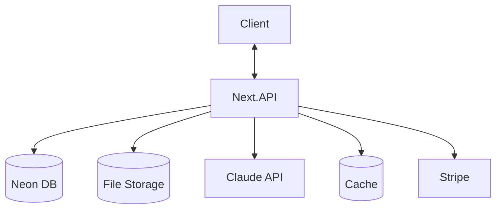
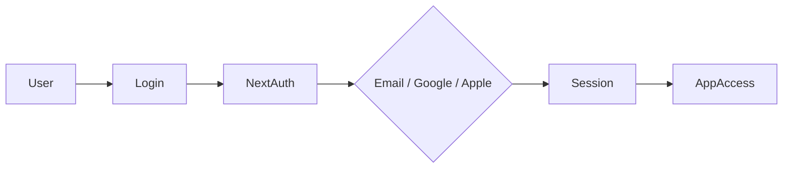
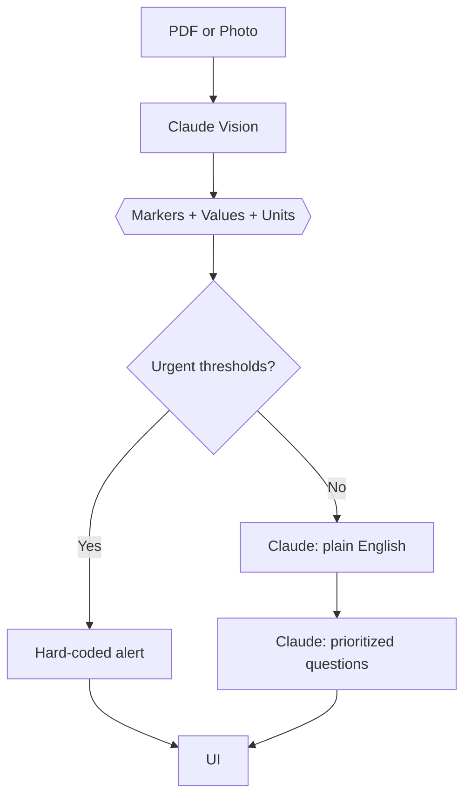

## Lumen Project Specifications

🧪 **AI-Powered Lab Result Translator** that turns confusing medical reports into plain-English explanations, flags, trends, and doctor-ready questions.

---

## 📌 Problem (Core Idea)

Patients receive lab results full of abbreviations, reference ranges, and cryptic flags they can't interpret:

- Raw PDFs with 40+ biomarkers and no context
- Patient portals that dump numbers with "consult your provider"
- Doctors with 4 minutes to explain 3 months of bloodwork
- WebMD spirals that turn mild findings into panic
- No way to track how markers have moved over time
- No idea which questions are actually worth asking
- Results scattered across Quest, LabCorp, Kaiser, MyChart

This creates **anxiety, confusion, and wasted appointments.**

➡️ **Lumen gives patients ONE calm, trustworthy, AI-powered second read on every lab result.**

---

## 🧑‍⚕️ Users

| Persona                    | Needs                                                        |
| -------------------------- | ------------------------------------------------------------ |
| The Curious Patient        | Understand what their annual bloodwork actually means        |
| The Chronic-Condition Manager | Track markers (A1c, thyroid, cholesterol) over time       |
| The Health-Conscious Optimizer | Interpret self-ordered tests (InsideTracker, Function Health) |
| The Caregiver              | Manage lab results for aging parents or dependents           |

---

## ✨ Core Features

### A) Upload Methods

Users can submit results through multiple channels:

- PDF upload (drag-drop or file picker)
- Camera snap (photo of printed report)
- Email forwarding (unique inbox per user)
- Patient portal connect (Quest, LabCorp, MyChart — future)

### B) The Translation

For every detected biomarker, Lumen returns:

- Plain-English explanation (one sentence)
- Status: Normal / Borderline / Flagged / Urgent
- What this marker measures (expandable tooltip)
- Reference range and user's value
- Confidence indicator (AI extraction certainty)

### C) Doctor Question Generator

3–5 prioritized, specific questions the user should bring to their next appointment — generated from their actual flagged values, not generic templates.

### D) Trends (Pro)

Sparkline and full-chart views showing how each marker has moved across past uploads. Context beats snapshots.

### E) Cohort Benchmarks (Pro)

"Your LDL is in the 62nd percentile for women 35–44." Optional, opt-in comparison against anonymized population data.

### F) Authentication

- Email + Password
- Google OAuth
- Apple Sign-In (mobile)

### G) Additional Features

- Family profiles (Pro) — manage results for up to 4 dependents
- Export PDF (translation + question list to show doctor)
- Favorites & saved reports
- Dark mode (opt-in; default is warm paper)
- Encrypted at rest + in transit

### H) AI Safety Rails

- **Hard-coded urgent triggers** — potassium > 6.0, troponin elevated, HbA1c > 10, etc. bypass the LLM and trigger "Contact your doctor or go to the ER" language
- Never diagnoses
- Never recommends specific medications or doses
- Always defers to clinicians on treatment
- Clinician-reviewed response templates for top 100 scenarios

> AI powered by **Claude Sonnet 4.5** for vision-based PDF extraction and plain-English translation. Structured JSON output for deterministic parsing.

---

## 🗄️ Data Model (Rough Prisma Draft)

> This schema is a starting point and **will evolve**

```prisma
model User {
  id                   String   @id @default(cuid())
  email                String   @unique
  password             String?
  fullName             String?
  dateOfBirth          DateTime?
  biologicalSex        String?   // for cohort benchmarks
  isPro                Boolean  @default(false)
  stripeCustomerId     String?
  stripeSubscriptionId String?
  reports              Report[]
  profiles             Profile[]
  createdAt            DateTime @default(now())
  updatedAt            DateTime @updatedAt
}

model Profile {
  id            String   @id @default(cuid())
  name          String   // "Mom", "Self", "Daughter"
  dateOfBirth   DateTime?
  biologicalSex String?
  relationship  String?
  userId        String
  user          User @relation(fields: [userId], references: [id])
  reports       Report[]
  createdAt     DateTime @default(now())
}

model Report {
  id            String   @id @default(cuid())
  source        String   // "pdf" | "photo" | "email" | "portal"
  fileUrl       String?
  fileName      String?
  labProvider   String?  // "Quest", "LabCorp", "Kaiser", etc.
  collectedAt   DateTime?
  uploadedAt    DateTime @default(now())
  status        String   // "processing" | "ready" | "failed"

  userId        String
  user          User @relation(fields: [userId], references: [id])

  profileId     String?
  profile       Profile? @relation(fields: [profileId], references: [id])

  markers       Marker[]
  questions     Question[]
  summary       String?  // overall plain-English summary
  flagCount     Int      @default(0)
  urgentFlag    Boolean  @default(false)
}

model Marker {
  id              String   @id @default(cuid())
  name            String   // "LDL Cholesterol"
  code            String?  // "LDL-C"
  value           Float
  unit            String   // "mg/dL"
  referenceMin    Float?
  referenceMax    Float?
  status          String   // "normal" | "borderline" | "flagged" | "urgent"
  explanation     String   // plain-English sentence
  whatItMeasures  String?  // tooltip content
  confidence      Float    // 0-1 AI extraction confidence

  reportId        String
  report          Report @relation(fields: [reportId], references: [id])

  createdAt       DateTime @default(now())
}

model Question {
  id         String @id @default(cuid())
  text       String
  priority   Int    // 1 = most important
  relatedTo  String? // marker name this is tied to

  reportId   String
  report     Report @relation(fields: [reportId], references: [id])
}

model MarkerCatalog {
  id             String @id @default(cuid())
  canonicalName  String @unique
  aliases        String[] // ["LDL", "LDL-C", "LDL Cholesterol"]
  category       String   // "lipids", "metabolic", "thyroid", etc.
  whatItMeasures String
  normalRangeMin Float?
  normalRangeMax Float?
  unit           String
  urgentHigh     Float?   // triggers hard-coded urgent alert
  urgentLow      Float?
}
```

---

## 🧱 Tech Stack

| Category     | Choice                         |
| ------------ | ------------------------------ |
| Framework    | **Next.js 15 (React 19)**      |
| Language     | TypeScript                     |
| Database     | Neon PostgreSQL + Prisma ORM   |
| Caching      | Redis (Upstash)                |
| File Storage | Cloudflare R2                  |
| CSS/UI       | Tailwind CSS v4 + ShadCN       |
| Auth         | NextAuth v5 (email + Google)   |
| AI           | Claude Sonnet 4.5 (Anthropic)  |
| Payments     | Stripe                         |
| Email        | Resend                         |
| Deployment   | Vercel                         |
| Monitoring   | Sentry                         |
| Analytics    | PostHog (privacy-friendly)     |

---

## 💰 Monetization

| Plan    | Price           | Limits                          | Features                                                   |
| ------- | --------------- | ------------------------------- | ---------------------------------------------------------- |
| Free    | $0              | 3 translations/month, 1 profile | Full translation, question generator, encrypted storage    |
| Lumen+  | $8/mo or $72/yr | Unlimited translations          | Trends, cohort benchmarks, 4 family profiles, PDF export   |

> Stripe Checkout + webhooks for subscription sync. 14-day free trial on Lumen+.

---

## 🎨 UI / UX

- **Paper-white default** (not dark mode) — `#F6F3EC` warm off-white
- Editorial, calm, clinical-meets-premium
- Serif headlines (Newsreader) paired with clean sans (Geist)
- Forest green accent `#1F5041` for trust
- Coral `#C8563A` for flags — warm, never alarming red
- Inspired by **The New York Times, Linear, premium clinic brands**

### Layout

- **Upload-first landing** — single CTA, drag-drop zone, camera option
- **Report view** — translation cards stacked, flagged items at top
- **Dashboard** — reports list, trend sparklines, profile switcher
- **Full-screen marker detail** — deep-dive on any single biomarker

### Responsive

- Mobile-first photo capture flow
- Touch-optimized marker cards
- PWA-installable for "add to home screen"

---

## 🔌 API Architecture



---

## 🔐 Auth Flow



---

## 🧠 AI Translation Flow



---

## 🛡️ Compliance & Safety

- **HIPAA-aligned architecture** — encrypted at rest (AES-256) and in transit (TLS 1.3)
- **BAA with Anthropic** required before handling real PHI
- **BAA with Vercel, Neon, Cloudflare** for production
- **No data sold. Ever.** Privacy policy reflects this.
- **SOC 2 Type II** target for year 2
- Wellness-app positioning: **no diagnosis, no treatment recommendations** (keeps product outside FDA medical-device regulation)
- Every response includes "Not a substitute for medical advice" footer

---

## 🗂️ Development Workflow

- **One branch per feature** (clean PR history)
- Claude Code for AI-assisted development
- Sentry for runtime monitoring
- GitHub Actions for CI (tests + type check)
- Preview deploys on every PR via Vercel

**Branch examples**:

```
git switch -c feat/pdf-upload
git switch -c feat/marker-translation
git switch -c feat/trends-view
```

---

## 🧭 Roadmap

### **MVP (Weeks 1–8)**

- PDF upload + Claude vision extraction
- Core marker translation (top 100 biomarkers)
- Doctor question generator
- Free tier limits
- Email + Google auth
- Marketing landing page

### **Pro Phase (Weeks 9–16)**

- Stripe billing + Lumen+ tier
- Trends view with sparklines
- Family profiles (up to 4)
- PDF export of translated report
- Photo capture flow (mobile)

### **Future Enhancements**

- Patient portal connections (MyChart, Quest, LabCorp direct pull)
- Apple Health / Google Fit integration
- Cohort benchmarking (requires real data volume)
- Email forwarding inbox per user
- Clinician-reviewed responses for rare markers
- B2B: white-label for primary care clinics
- Mobile app (React Native)

---

## 📊 Key Metrics

| Metric                        | Target (Year 1)   |
| ----------------------------- | ----------------- |
| Time-to-translation           | < 10 seconds      |
| Marker extraction accuracy    | > 97%             |
| Free → Pro conversion         | 5–8%              |
| Monthly active users          | 25,000            |
| Net Promoter Score            | > 60              |
| Urgent-flag false-negative rate | 0%              |

---

## 📌 Status

- In planning
- Ready for environment setup & UI scaffolding

---

🧪 **Lumen — Stop guessing. Start understanding.**
